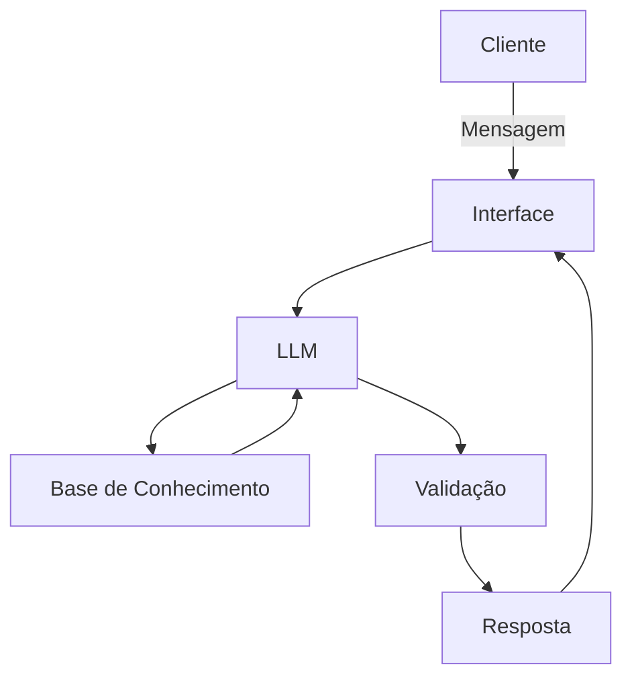

# 📈 ALDO — Assistente Financeiro Inteligente

> Educação financeira acessível, privada e com dados reais do Banco Central do Brasil.


---

## 📌 Sobre o Projeto

O **ALDO** é um assistente virtual focado em educação financeira, projetado para explicar indicadores econômicos oficiais do Brasil — como **Selic, IPCA, CDI** e outros — de forma didática, acessível e segura.

O projeto foi construído com foco em **privacidade total e precisão de dados**, utilizando uma arquitetura que consome informações em tempo real da API oficial do Banco Central e processa linguagem natural 100% localmente, sem enviar nenhum dado para servidores externos.

---

## 🏗️ Arquitetura

### Fluxo de Funcionamento



### Componentes

| Componente | Descrição |
|---|---|
| **Interface** | HTML5, CSS (Tailwind) e JavaScript para interação, conectado ao back-end em Python via Streamlit. |
| **LLM** | Modelo open-source Llama 3.1 8B Instruct (GGUF Q4_K_M), executado 100% localmente e offline via LM Studio. A integração com o back-end é feita por um servidor de inferência local, garantindo privacidade total, zero custo de requisição e imunidade a instabilidades de rede. |
| **Base de Conhecimento** | Dados consumidos em tempo real via requisições JSON à API oficial do Banco Central do Brasil (SGS). |
| **Validação** | Camada de segurança implementada em Python para dupla checagem: respostas estritamente ancoradas nos números oficiais da API e bloqueio de qualquer conteúdo que configure recomendação direta de investimentos. |

---

## ✨ Diferenciais

| Diferencial | Descrição |
|---|---|
| 🎯 **Zero Alucinação de Dados** | O modelo não usa memória pré-treinada para informar taxas. Os dados são extraídos em tempo real via API oficial do Banco Central do Brasil (BCB/SGS). |
| 🔒 **Inferência 100% Local** | O processamento de linguagem natural ocorre inteiramente na máquina do usuário via LM Studio, garantindo privacidade total e eliminando custos com APIs externas. |
| 🛡️ **Guardrails Rígidos** | O assistente possui instruções estritas para não recomendar investimentos e para bloquear perguntas fora do escopo de educação financeira. |
| 💬 **Interface Web Reativa** | Front-end construído com Streamlit, oferecendo uma experiência de chat fluida com retenção de histórico de conversa. |

---

## 🛠️ Tecnologias Utilizadas

- **Python 3** — Motor principal da aplicação
- **Streamlit** — Interface gráfica web
- **LM Studio** — Servidor local de inferência de IA
- **Llama 3.1 8B Instruct (GGUF Q4_K_M)** — Modelo de linguagem open-source testado e otimizado
- **Requests** — Integração com a API REST do Banco Central do Brasil (SGS)

---

## 📁 Estrutura do Repositório

```
dio-lab-bia-do-futuro/
│
├── src/                              # Código-fonte da aplicação
│   ├── aldo_app.py                   # Versão de testes via terminal
│   ├── aldo_web.py                   # Versão principal com interface Streamlit
│   └── requirements.txt             # Dependências do projeto
│
└── docs/                             # Documentação de apoio
    ├── 01-documentacao-agente.md     # Visão geral e arquitetura do agente
    ├── 02-base-conhecimento.md       # Estratégia de integração e uso dos dados
    ├── 03-prompts.md                 # Estrutura de injeção de contexto e regras
    ├── 04-metricas.md                # Resultados de testes de estresse (QA)
    └── 05-pitch.md                   # Roteiro de apresentação da solução
```

---

## ⚙️ Como Executar o Projeto

### Pré-requisitos

- Python 3.9 ou superior
- [LM Studio](https://lmstudio.ai/) instalado
- Modelo `Llama-3.1-8B-Instruct-GGUF` baixado no LM Studio

---

### Passo 1 — Preparar o Servidor de IA (LM Studio)

1. Faça o download e instale o [LM Studio](https://lmstudio.ai/).
2. Na aba **Discover**, busque e baixe o modelo `Llama-3.1-8B-Instruct-GGUF`.
3. Vá até a aba **Local Server** e inicie o servidor na porta `1234`.

> 💡 Deixe o LM Studio rodando em segundo plano durante todo o uso do ALDO.

---

### Passo 2 — Preparar o Ambiente Python

Clone o repositório e instale as dependências:

```bash
git clone https://github.com/a-r-soares/dio-lab-bia-do-futuro.git
cd dio-lab-bia-do-futuro/src
pip install -r requirements.txt
```

---

### Passo 3 — Iniciar o ALDO

Com o servidor do LM Studio ativo, execute a interface web:

```bash
streamlit run aldo_web.py
```

O navegador abrirá automaticamente em **http://localhost:8501** com o assistente pronto para uso! 🎉

---

## 🧪 Testes via Terminal

Para testar o assistente sem a interface gráfica:

```bash
python aldo_app.py
```

---

## 🗺️ Roadmap

- [x] Integração com API do Banco Central (Selic, IPCA, CDI)
- [x] Inferência local via LM Studio
- [x] Interface web com Streamlit
- [x] Guardrails de validação e segurança
- [ ] Suporte a mais indicadores econômicos (IGPM, Câmbio, etc.)
- [ ] Histórico de conversas persistente
- [ ] Deploy em container Docker

---

## 🤝 Contribuindo

Contribuições são bem-vindas! Para contribuir:

1. Faça um **fork** do projeto
2. Crie uma branch para sua feature (`git checkout -b feature/minha-feature`)
3. Faça o commit das suas alterações (`git commit -m 'feat: adiciona nova feature'`)
4. Envie para a branch (`git push origin feature/minha-feature`)
5. Abra um **Pull Request**

---

## 📄 Licença

Este projeto está sob a licença MIT. Veja o arquivo [LICENSE](LICENSE) para mais detalhes.

---

## 👤 Autor

Desenvolvido por **[a-r-soares](https://github.com/a-r-soares)** como parte de um laboratório da [DIO — Digital Innovation One](https://www.dio.me/).
